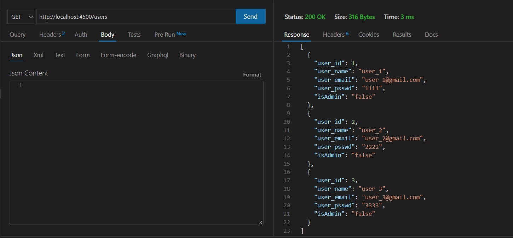
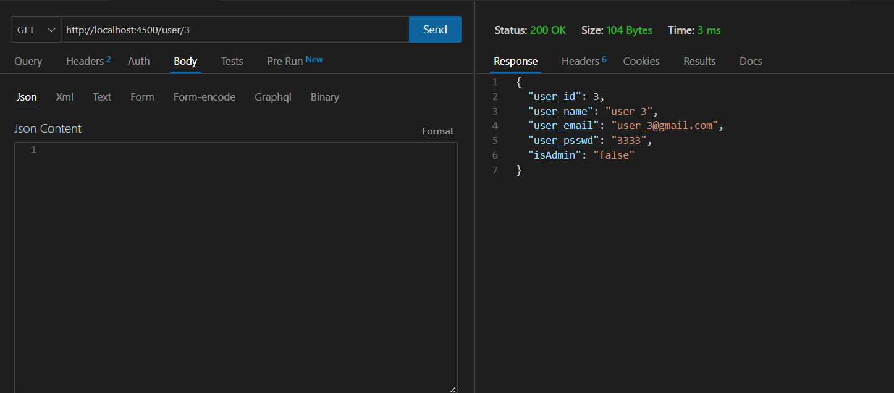
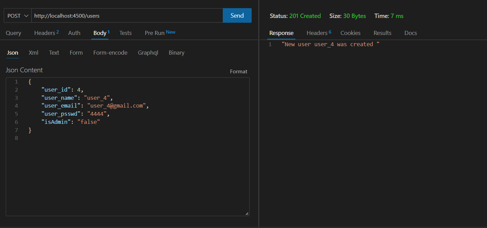
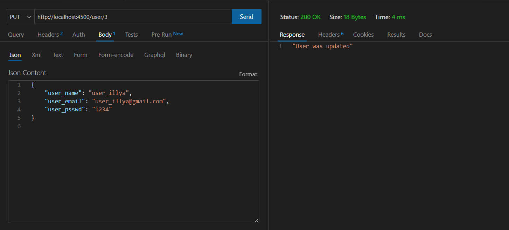
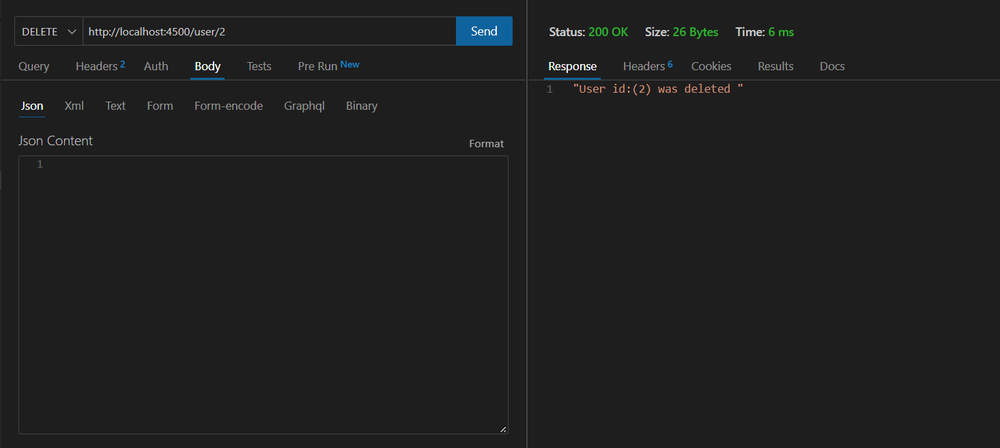
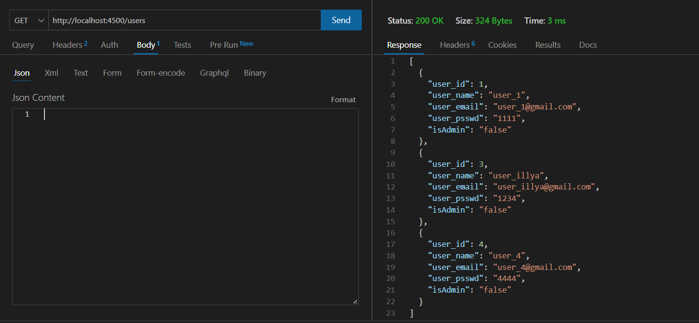

# Тестування працездатності системи
 
## Отримання всієї таблиці users

  

## Отримання окремого члена таблиці users

  

## Створення нового члена таблиці users

  

## Редагування члена таблиці users

  

## Видалення члена таблиці users

  

## Фінальний результат

  

